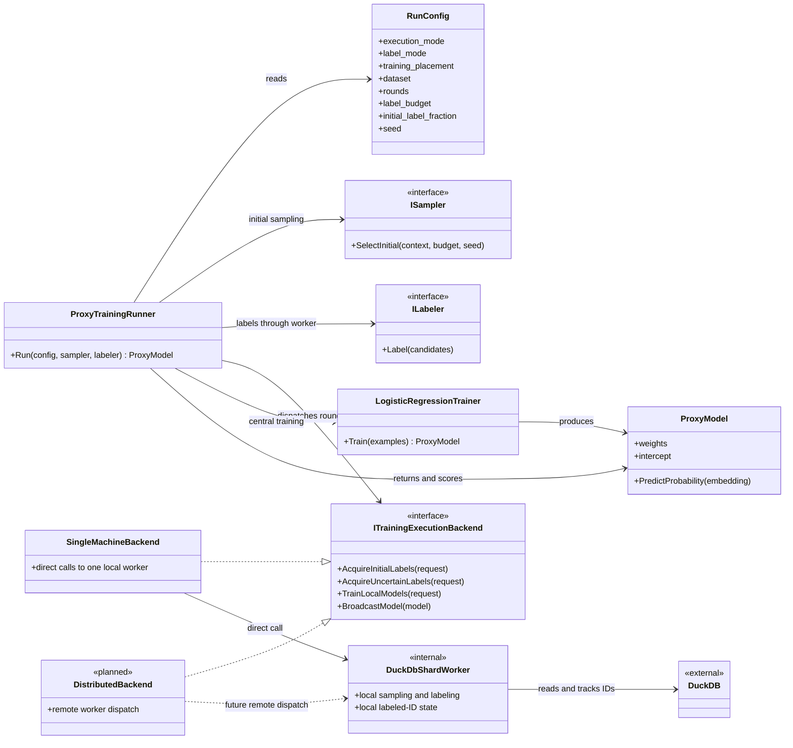

# Kea Architecture

This is the single source of truth for Kea's architecture. Solid arrows are
implemented; the dashed distributed backend is future work.

`ProxyTrainingRunner` owns the round schedule and central training. In
single-machine mode it creates an internal `DuckDbShardWorker`, wraps it in
`SingleMachineBackend`, and routes initial and uncertainty-label acquisition
through `ITrainingExecutionBackend`. The missing piece is a real distributed
backend that sends the same requests to multiple remote shard workers.
