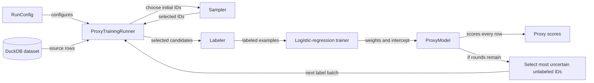

# SemBench single-machine sweep: equal label budgets

## System (single-machine implementation)

## Run configuration parameters

| Parameter | Values or type | What it does and why it exists |
| --- | --- | --- |
| `execution_mode` | `SingleMachine`, `Distributed` | Chooses one local DuckDB worker or multiple workers. It exists so the same run definition can later use distributed execution. Only `SingleMachine` is implemented. |
| `rounds` | positive integer | Sets the total number of label-and-train rounds. It exists to switch between one-shot training (`1`) and recursive uncertainty sampling (`>1`). |
| `label_budget` | positive integer | Sets the total number of oracle labels available across all rounds. It exists to compare proxy quality under a fixed labeling cost. |
| `initial_label_fraction` | number in `(0, 1]` | Allocates the fraction of the total budget used before the first model is trained. It exists to control the coverage-versus-active-learning tradeoff in recursive runs. |

## Extensible components

- **Initial sampler:** `RandomSampler` and `ClusterSampler` are current `ISampler` implementations. The cluster sampler accepts `cluster_count` and `max_iterations` options.
- **Labeler:** the current `FunctionLabeler` returns the stored gold label for each dataset row; it does not make LLM calls.
- **Trainer:** `LogisticRegressionTrainer` supports an `l2_regularization` option.

## Sweep

| Parameter | Values |
| --- | --- |
| Datasets | SemBench Movie, FEVER |
| Rows per dataset | 3,000 |
| Embedding dimensions | 1,024 |
| Initial sampler | Random, cluster |
| Label budget | 32, 64, 128 for both samplers |
| Total rounds | 1, 3, 5 |
| Initial-label fraction | 1.000 for 1 round; 0.200 for 3 or 5 rounds |
| Labeler | Dataset ground-truth oracle |
| Runs | 108 total; reported values average three repetitions |

## Labeling protocol

Stored dataset ground-truth labels are used as a perfect oracle; no real LLM calls are made. Labeling time is simulated at a hosted-API rate of 75 labels per second. Local oracle lookup time is not reported as labeling duration.

## End-to-end results

Each row reports a complete training run. **Sampling and fetching** includes initial selection, selected-row access, and recursive uncertainty selection when applicable. **Simulated labeling** is the total label count divided by 75 labels/second. **Training** includes the initial logistic-regression fit and every recursive retraining fit. Together, these columns are the estimated end-to-end Phase-A cost for that run.

### Random sampling

All values are milliseconds and average three seeds.

**Legend**

- **Initial selection:** choose the first label batch with the seeded random-ID query.
- **Initial fetch:** retrieve the selected rows' text and embeddings for labeling.
- **Recursive candidate preparation:** load embeddings into the cache when needed, exclude already labeled rows, and build the current candidate list: every still-unlabeled row's ID and embedding. The next batch must be chosen from this list because the proxy needs to compare uncertainty across all available unlabeled rows.
- **Recursive select/rank:** score candidates with the current proxy, rank them by uncertainty, and retain the next batch.
- **Sim. labeling:** estimated hosted-API time for all oracle labels at 75 labels/second.
- **Training:** initial logistic-regression fit plus every recursive retraining fit.
- **Est. total:** sum of the timing stages shown.

| Dataset | Budget | Rounds | Initial selection | Initial fetch | Recursive candidate prep | Recursive select/rank | Sim. labeling | Training | Est. total | Accuracy | AURAC |
| --- | ---: | ---: | ---: | ---: | ---: | ---: | ---: | ---: | ---: | ---: | ---: |
| FEVER | 32 | 1 | 0.3 | 3.8 | 0.0 | 0.0 | 426.7 | 0.9 | 431.8 | 0.540 | 0.566 |
| FEVER | 32 | 3 | 0.3 | 1.0 | 310.6 | 5.8 | 426.7 | 2.1 | 746.6 | 0.530 | 0.561 |
| FEVER | 32 | 5 | 0.4 | 1.1 | 311.1 | 11.6 | 426.7 | 3.5 | 754.3 | 0.521 | 0.545 |
| FEVER | 64 | 1 | 0.4 | 7.4 | 0.0 | 0.0 | 853.3 | 1.6 | 862.7 | 0.557 | 0.590 |
| FEVER | 64 | 3 | 0.4 | 1.7 | 310.3 | 5.9 | 853.3 | 3.1 | 1174.7 | 0.540 | 0.567 |
| FEVER | 64 | 5 | 0.4 | 1.8 | 314.0 | 12.0 | 853.3 | 5.3 | 1186.8 | 0.533 | 0.562 |
| FEVER | 128 | 1 | 0.4 | 14.5 | 0.0 | 0.0 | 1706.7 | 3.1 | 1724.7 | 0.577 | 0.604 |
| FEVER | 128 | 3 | 0.4 | 3.2 | 310.8 | 6.0 | 1706.7 | 5.2 | 2032.3 | 0.557 | 0.576 |
| FEVER | 128 | 5 | 0.4 | 3.2 | 312.5 | 12.1 | 1706.7 | 9.4 | 2044.2 | 0.568 | 0.597 |
| Movie | 32 | 1 | 0.8 | 5.1 | 0.0 | 0.0 | 426.7 | 1.2 | 433.8 | 0.803 | 0.908 |
| Movie | 32 | 3 | 0.5 | 1.3 | 316.5 | 5.9 | 426.7 | 2.3 | 753.1 | 0.802 | 0.902 |
| Movie | 32 | 5 | 0.5 | 1.2 | 328.2 | 12.2 | 426.7 | 4.1 | 772.9 | 0.810 | 0.913 |
| Movie | 64 | 1 | 0.6 | 8.4 | 0.0 | 0.0 | 853.3 | 1.8 | 864.2 | 0.831 | 0.922 |
| Movie | 64 | 3 | 0.4 | 2.0 | 313.7 | 6.1 | 853.3 | 3.4 | 1178.9 | 0.804 | 0.891 |
| Movie | 64 | 5 | 0.4 | 1.8 | 313.0 | 12.3 | 853.3 | 5.4 | 1186.2 | 0.832 | 0.921 |
| Movie | 128 | 1 | 0.4 | 14.7 | 0.0 | 0.0 | 1706.7 | 2.9 | 1724.8 | 0.846 | 0.915 |
| Movie | 128 | 3 | 0.4 | 3.4 | 314.6 | 6.7 | 1706.7 | 6.4 | 2038.2 | 0.864 | 0.916 |
| Movie | 128 | 5 | 0.4 | 3.3 | 312.0 | 12.3 | 1706.7 | 8.9 | 2043.6 | 0.868 | 0.922 |

### Cluster sampling

All values are milliseconds and average three seeds.

Cluster sampling runs k-means over all embeddings, partitions similar rows into `K` clusters, and uses the row nearest each cluster centroid as a representative initial label candidate. This aims to spread the initial labels across the dataset rather than selecting them purely at random.

**Legend**

- **Embedding load:** read every row ID and DuckDB `FLOAT[]` embedding, then convert embeddings into cached C++ float vectors.
- Random one-round sampling has no corresponding full-table load because it fetches embeddings only for its selected rows; recursive random runs incur the full load under **Recursive candidate preparation**.
- **K-means + reps:** copy cached embeddings into the mlpack matrix, run k-means, and choose the row nearest each centroid.
- **Initial fetch:** retrieve the selected representatives' text for labeling.
- **Recursive candidate preparation:** exclude labeled rows and build the current candidate list from the embedding cache: every still-unlabeled row's ID and embedding. The next batch must be chosen from this list because the proxy needs to compare uncertainty across all available unlabeled rows.
- **Recursive select/rank:** score candidates with the current proxy, rank them by uncertainty, and retain the next batch.
- **Sim. labeling:** estimated hosted-API time for all oracle labels at 75 labels/second.
- **Training:** initial logistic-regression fit plus every recursive retraining fit.
- **Est. total:** sum of the timing stages shown.

| Dataset | Budget / K | Rounds | Embedding load | K-means + reps | Initial fetch | Recursive candidate prep | Recursive select/rank | Sim. labeling | Training | Est. total | Accuracy | AURAC |
| --- | ---: | ---: | ---: | ---: | ---: | ---: | ---: | ---: | ---: | ---: | ---: | ---: |
| FEVER | 32 | 1 | 306.8 | 565.9 | 1.1 | 0.0 | 0.0 | 426.7 | 1.0 | 1301.5 | 0.528 | 0.548 |
| FEVER | 32 | 3 | 307.8 | 565.3 | 0.9 | 2.4 | 5.8 | 426.7 | 2.3 | 1311.2 | 0.511 | 0.513 |
| FEVER | 32 | 5 | 309.7 | 564.9 | 0.9 | 4.8 | 11.7 | 426.7 | 3.7 | 1322.3 | 0.513 | 0.518 |
| FEVER | 64 | 1 | 306.9 | 1151.8 | 1.5 | 0.0 | 0.0 | 853.3 | 1.7 | 2315.2 | 0.548 | 0.569 |
| FEVER | 64 | 3 | 315.1 | 1151.0 | 1.1 | 2.7 | 6.0 | 853.3 | 3.3 | 2332.5 | 0.539 | 0.567 |
| FEVER | 64 | 5 | 303.8 | 1151.4 | 0.9 | 4.4 | 11.9 | 853.3 | 5.1 | 2330.7 | 0.545 | 0.575 |
| FEVER | 128 | 1 | 307.4 | 2503.4 | 2.3 | 0.0 | 0.0 | 1706.7 | 3.0 | 4522.8 | 0.572 | 0.589 |
| FEVER | 128 | 3 | 305.9 | 2442.0 | 1.1 | 2.4 | 6.0 | 1706.7 | 6.1 | 4470.2 | 0.545 | 0.564 |
| FEVER | 128 | 5 | 317.5 | 2478.7 | 1.3 | 4.4 | 14.7 | 1706.7 | 10.3 | 4533.6 | 0.558 | 0.576 |
| Movie | 32 | 1 | 304.9 | 567.4 | 1.2 | 0.0 | 0.0 | 426.7 | 0.9 | 1301.1 | 0.830 | 0.932 |
| Movie | 32 | 3 | 303.0 | 566.2 | 0.8 | 2.6 | 5.9 | 426.7 | 2.1 | 1307.3 | 0.828 | 0.924 |
| Movie | 32 | 5 | 305.1 | 564.9 | 0.8 | 4.5 | 11.9 | 426.7 | 3.5 | 1317.5 | 0.823 | 0.920 |
| Movie | 64 | 1 | 304.8 | 1153.5 | 1.5 | 0.0 | 0.0 | 853.3 | 1.5 | 2314.6 | 0.858 | 0.939 |
| Movie | 64 | 3 | 306.4 | 1153.3 | 0.9 | 2.4 | 6.2 | 853.3 | 3.2 | 2325.7 | 0.832 | 0.917 |
| Movie | 64 | 5 | 306.8 | 1153.3 | 0.9 | 5.0 | 12.4 | 853.3 | 5.3 | 2337.1 | 0.848 | 0.925 |
| Movie | 128 | 1 | 306.2 | 2426.7 | 2.1 | 0.0 | 0.0 | 1706.7 | 2.8 | 4444.5 | 0.869 | 0.938 |
| Movie | 128 | 3 | 306.3 | 2427.1 | 1.2 | 2.5 | 6.2 | 1706.7 | 5.6 | 4455.6 | 0.866 | 0.915 |
| Movie | 128 | 5 | 302.3 | 2425.1 | 1.2 | 4.7 | 12.3 | 1706.7 | 9.0 | 4461.2 | 0.865 | 0.923 |
