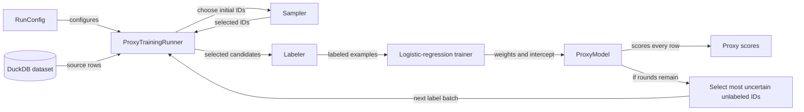

# SemBench single-machine sweep: equal label budgets

## Labeling protocol

Stored dataset ground-truth labels are used as a perfect oracle; no real LLM calls are made. Labeling time is simulated at a hosted-API rate of 75 labels per second. Local oracle lookup time is not reported as labeling duration.

## System (single-machine implementation)

## Run configuration parameters

| Parameter | Values or type | What it does and why it exists |
| --- | --- | --- |
| `execution_mode` | `SingleMachine`, `Distributed` | Chooses one local DuckDB worker or multiple workers. It exists so the same run definition can later use distributed execution. Only `SingleMachine` is implemented. |
| `rounds` | positive integer | Sets the total number of label-and-train rounds. It exists to switch between one-shot training (`1`) and recursive uncertainty sampling (`>1`). |
| `label_budget` | positive integer | Sets the total number of oracle labels available across all rounds. It exists to compare proxy quality under a fixed labeling cost. |
| `initial_label_fraction` | number in `(0, 1]` | Allocates the fraction of the total budget used before the first model is trained. It exists to control the coverage-versus-active-learning tradeoff in recursive runs. |

## Extensible components

- **Initial sampler:** `RandomSampler` and `ClusterSampler` are current `ISampler` implementations. The cluster sampler accepts `cluster_count` and `max_iterations` options.
- **Labeler:** the current `FunctionLabeler` returns the stored gold label for each dataset row; it does not make LLM calls.
- **Trainer:** `LogisticRegressionTrainer` supports an `l2_regularization` option.

## Sweep

| Parameter | Values |
| --- | --- |
| Datasets | SemBench Movie, FEVER |
| Rows per dataset | 3,000 |
| Embedding dimensions | 1,024 |
| Initial sampler | Random, cluster |
| Label budget | 32, 64, 128 for both samplers |
| Total rounds | 1, 3, 5 |
| Initial-label fraction | 1.000 for 1 round; 0.200 for 3 or 5 rounds |
| Labeler | Dataset ground-truth oracle |
| Runs | 108 total; reported values average three repetitions |

## Measured timing categories

| Category | Included work |
| --- | --- |
| Sampling and fetching | Initial sampling, initial candidate fetch, and every recursive uncertainty-selection and candidate-fetch step |
| Labeling | Simulated hosted-API labeling duration: total label budget at 75 labels per second |
| Training | Initial logistic-regression fit and every recursive retraining fit |

## Timing breakdown (post-cache)

The worker holds a lazy per-run `id + embedding` cache. Cluster sampling loads it once; random sampling loads it on its first recursive round. Text is fetched only for the selected label batch.

### One-round cluster sampling

| K / label budget | Load embeddings from DuckDB (ms) | Cluster and select representatives (ms) | Fetch selected rows for labeling (ms) |
| ---: | ---: | ---: | ---: |
| 32 | 305.9 | 566.7 | 1.1 |
| 64 | 305.8 | 1152.6 | 1.5 |
| 128 | 306.8 | 2465.1 | 2.2 |

“Load embeddings” includes the DuckDB query and conversion of `FLOAT[]` values into cached C++ float vectors. “Cluster and select representatives” includes the small matrix copy, k-means, and choosing the closest row to each centroid.

### Open performance issue: DuckDB-to-C++ embedding conversion

The approximately 300 ms candidate-materialization cost is the conversion of DuckDB `FLOAT[]` values into C++ `std::vector<float>` embeddings while constructing the cache. The cache ensures this occurs at most once per run, but it does not eliminate the conversion itself. Because embeddings are fixed, a future system should evaluate a process-level embedding store backed by a contiguous float32 file or memory-mapped artifact, so this cost moves to dataset startup rather than proxy training.

### Recursive uncertainty selection

Values are averages across both datasets, both samplers, all three budgets, and three repetitions.

| Total rounds | Additional uncertainty rounds | Candidate preparation, total (ms) | Proxy scoring and ranking, total (ms) | Candidate preparation, average / round (ms) | Proxy scoring and ranking, average / round (ms) |
| ---: | ---: | ---: | ---: | ---: | ---: |
| 3 | 2 | 157.6 | 6.0 | 78.8 | 3.0 |
| 5 | 4 | 159.8 | 12.3 | 40.0 | 3.1 |

**Legend**

- **Candidate preparation:** load the embedding cache if it is not already available, remove previously labeled IDs, and construct the current unlabeled candidate list. Random sampling performs the expensive DuckDB-to-C++ cache load in its first recursive round; cluster sampling usually completed it during initial sampling.
- **Proxy scoring and ranking:** compute each candidate's probability with the current logistic-regression model, measure uncertainty as `abs(probability - 0.5)`, rank candidates from least to most certain, and retain the requested batch.
- **Not included above:** fetching text for that small selected batch, oracle labeling, and logistic-regression retraining. Those belong respectively to the document's top-level **Sampling and fetching**, **Simulated labeling**, and **Training** columns.

## Best AURAC configuration per sampler and budget

| Dataset | Sampler | Budget | Rounds | Initial fraction | Sampling and fetching (ms) | Simulated labeling (ms) | Training (ms) | Proxy accuracy | AURAC |
| --- | --- | ---: | ---: | ---: | ---: | ---: | ---: | ---: | ---: |
| FEVER | cluster | 32 | 1 | 1.000 | 873.9 | 426.7 | 1.0 | 0.528 | 0.548 |
| FEVER | cluster | 64 | 5 | 0.200 | 1472.3 | 853.3 | 5.1 | 0.545 | 0.575 |
| FEVER | cluster | 128 | 1 | 1.000 | 2813.1 | 1706.7 | 3.0 | 0.572 | 0.589 |
| FEVER | random | 32 | 1 | 1.000 | 4.1 | 426.7 | 0.9 | 0.540 | 0.566 |
| FEVER | random | 64 | 1 | 1.000 | 7.8 | 853.3 | 1.6 | 0.557 | 0.590 |
| FEVER | random | 128 | 1 | 1.000 | 14.9 | 1706.7 | 3.1 | 0.577 | 0.604 |
| Movie | cluster | 32 | 1 | 1.000 | 873.6 | 426.7 | 0.9 | 0.830 | 0.932 |
| Movie | cluster | 64 | 1 | 1.000 | 1459.8 | 853.3 | 1.5 | 0.858 | 0.939 |
| Movie | cluster | 128 | 1 | 1.000 | 2735.0 | 1706.7 | 2.8 | 0.869 | 0.938 |
| Movie | random | 32 | 5 | 0.200 | 342.1 | 426.7 | 4.1 | 0.810 | 0.913 |
| Movie | random | 64 | 1 | 1.000 | 9.0 | 853.3 | 1.8 | 0.831 | 0.922 |
| Movie | random | 128 | 5 | 0.200 | 328.0 | 1706.7 | 8.9 | 0.868 | 0.922 |

## Appendix: configuration averages

| Dataset | Sampler | Budget | Rounds | Initial fraction | Sampling and fetching (ms) | Simulated labeling (ms) | Training (ms) | Proxy accuracy | AURAC |
| --- | --- | ---: | ---: | ---: | ---: | ---: | ---: | ---: | ---: |
| FEVER | cluster | 32 | 1 | 1.000 | 873.9 | 426.7 | 1.0 | 0.528 | 0.548 |
| FEVER | cluster | 32 | 3 | 0.200 | 882.3 | 426.7 | 2.3 | 0.511 | 0.513 |
| FEVER | cluster | 32 | 5 | 0.200 | 891.9 | 426.7 | 3.7 | 0.513 | 0.518 |
| FEVER | cluster | 64 | 1 | 1.000 | 1460.3 | 853.3 | 1.7 | 0.548 | 0.569 |
| FEVER | cluster | 64 | 3 | 0.200 | 1475.9 | 853.3 | 3.3 | 0.539 | 0.567 |
| FEVER | cluster | 64 | 5 | 0.200 | 1472.3 | 853.3 | 5.1 | 0.545 | 0.575 |
| FEVER | cluster | 128 | 1 | 1.000 | 2813.1 | 1706.7 | 3.0 | 0.572 | 0.589 |
| FEVER | cluster | 128 | 3 | 0.200 | 2757.5 | 1706.7 | 6.1 | 0.545 | 0.564 |
| FEVER | cluster | 128 | 5 | 0.200 | 2816.7 | 1706.7 | 10.3 | 0.558 | 0.576 |
| FEVER | random | 32 | 1 | 1.000 | 4.1 | 426.7 | 0.9 | 0.540 | 0.566 |
| FEVER | random | 32 | 3 | 0.200 | 317.8 | 426.7 | 2.1 | 0.530 | 0.561 |
| FEVER | random | 32 | 5 | 0.200 | 324.1 | 426.7 | 3.5 | 0.521 | 0.545 |
| FEVER | random | 64 | 1 | 1.000 | 7.8 | 853.3 | 1.6 | 0.557 | 0.590 |
| FEVER | random | 64 | 3 | 0.200 | 318.3 | 853.3 | 3.1 | 0.540 | 0.567 |
| FEVER | random | 64 | 5 | 0.200 | 328.2 | 853.3 | 5.3 | 0.533 | 0.562 |
| FEVER | random | 128 | 1 | 1.000 | 14.9 | 1706.7 | 3.1 | 0.577 | 0.604 |
| FEVER | random | 128 | 3 | 0.200 | 320.4 | 1706.7 | 5.2 | 0.557 | 0.576 |
| FEVER | random | 128 | 5 | 0.200 | 328.2 | 1706.7 | 9.4 | 0.568 | 0.597 |
| Movie | cluster | 32 | 1 | 1.000 | 873.6 | 426.7 | 0.9 | 0.830 | 0.932 |
| Movie | cluster | 32 | 3 | 0.200 | 878.5 | 426.7 | 2.1 | 0.828 | 0.924 |
| Movie | cluster | 32 | 5 | 0.200 | 887.3 | 426.7 | 3.5 | 0.823 | 0.920 |
| Movie | cluster | 64 | 1 | 1.000 | 1459.8 | 853.3 | 1.5 | 0.858 | 0.939 |
| Movie | cluster | 64 | 3 | 0.200 | 1469.2 | 853.3 | 3.2 | 0.832 | 0.917 |
| Movie | cluster | 64 | 5 | 0.200 | 1478.4 | 853.3 | 5.3 | 0.848 | 0.925 |
| Movie | cluster | 128 | 1 | 1.000 | 2735.0 | 1706.7 | 2.8 | 0.869 | 0.938 |
| Movie | cluster | 128 | 3 | 0.200 | 2743.4 | 1706.7 | 5.6 | 0.866 | 0.915 |
| Movie | cluster | 128 | 5 | 0.200 | 2745.6 | 1706.7 | 9.0 | 0.865 | 0.923 |
| Movie | random | 32 | 1 | 1.000 | 6.0 | 426.7 | 1.2 | 0.803 | 0.908 |
| Movie | random | 32 | 3 | 0.200 | 324.2 | 426.7 | 2.3 | 0.802 | 0.902 |
| Movie | random | 32 | 5 | 0.200 | 342.1 | 426.7 | 4.1 | 0.810 | 0.913 |
| Movie | random | 64 | 1 | 1.000 | 9.0 | 853.3 | 1.8 | 0.831 | 0.922 |
| Movie | random | 64 | 3 | 0.200 | 322.2 | 853.3 | 3.4 | 0.804 | 0.891 |
| Movie | random | 64 | 5 | 0.200 | 327.5 | 853.3 | 5.4 | 0.832 | 0.921 |
| Movie | random | 128 | 1 | 1.000 | 15.1 | 1706.7 | 2.9 | 0.846 | 0.915 |
| Movie | random | 128 | 3 | 0.200 | 325.2 | 1706.7 | 6.4 | 0.864 | 0.916 |
| Movie | random | 128 | 5 | 0.200 | 328.0 | 1706.7 | 8.9 | 0.868 | 0.922 |
